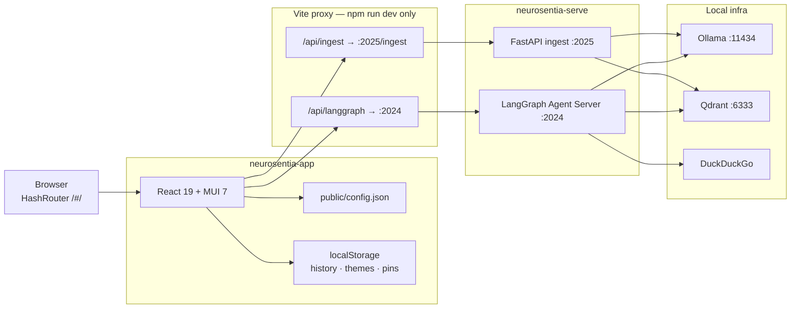
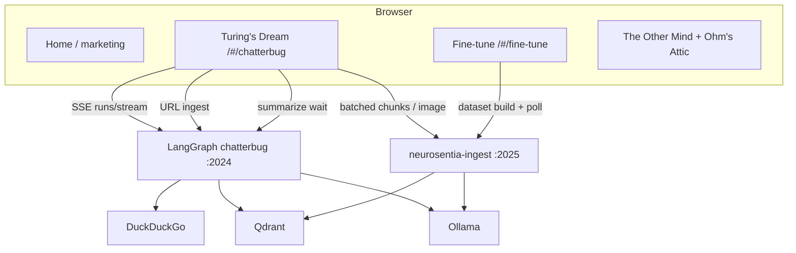
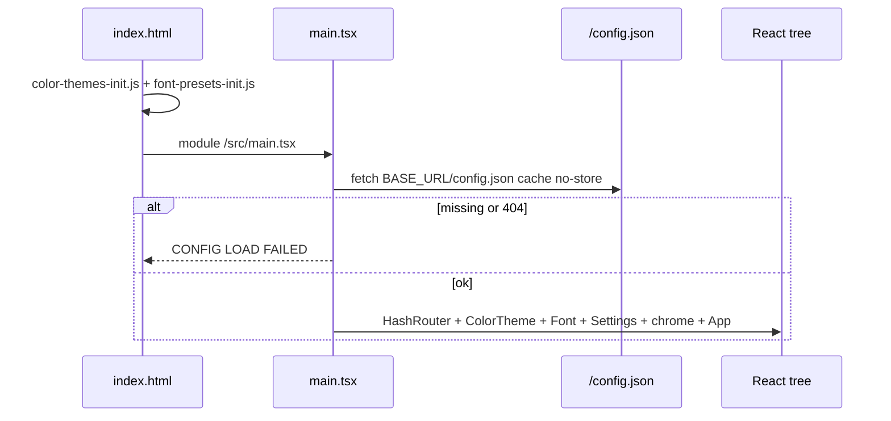
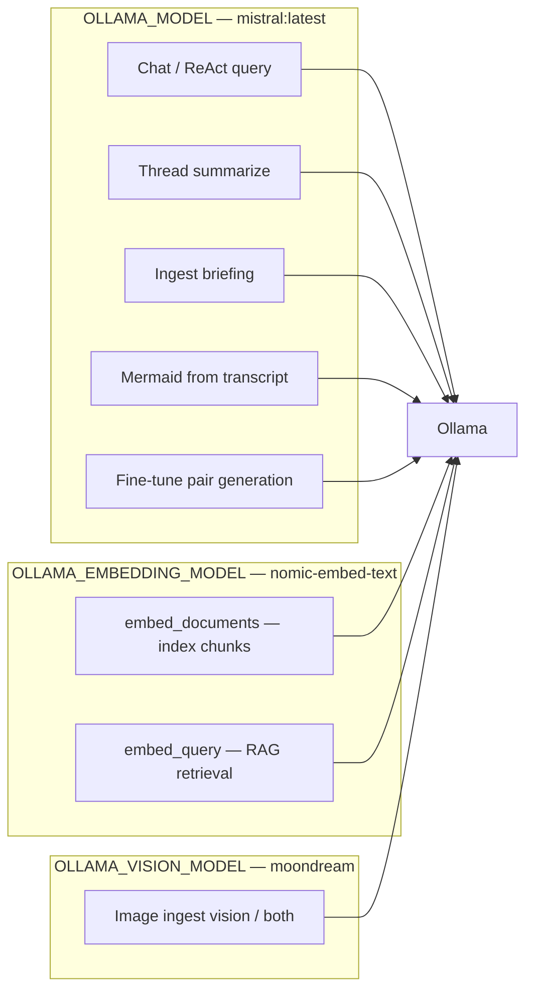
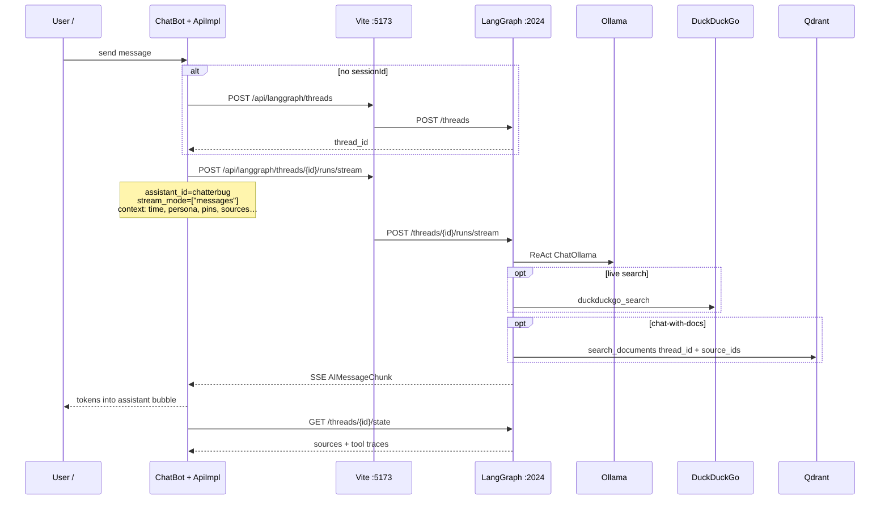
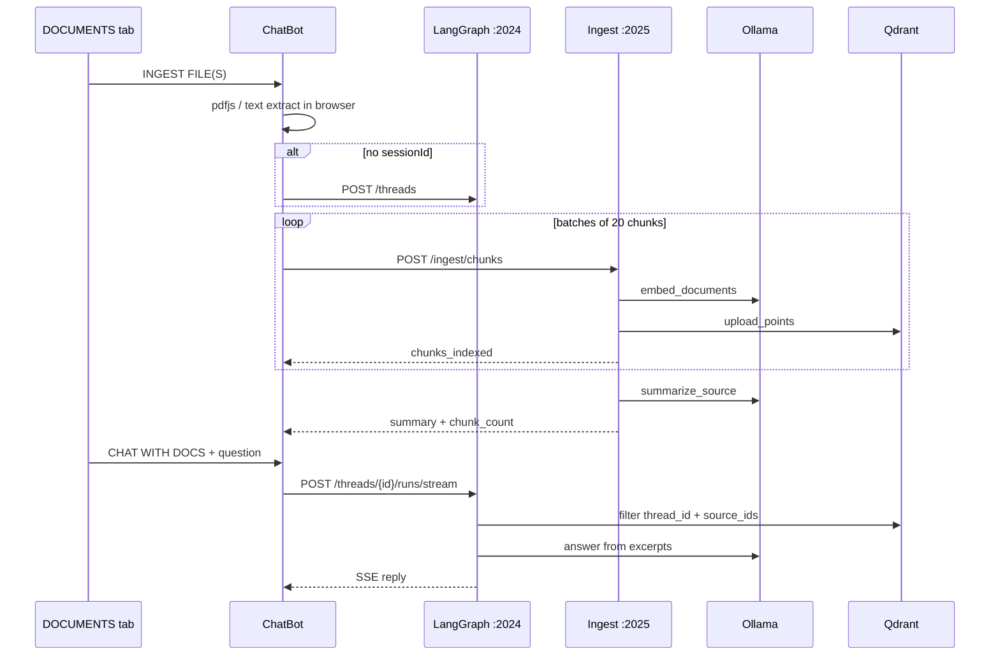
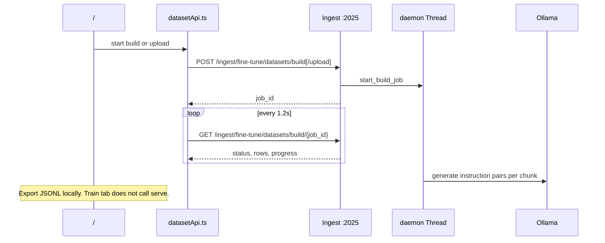
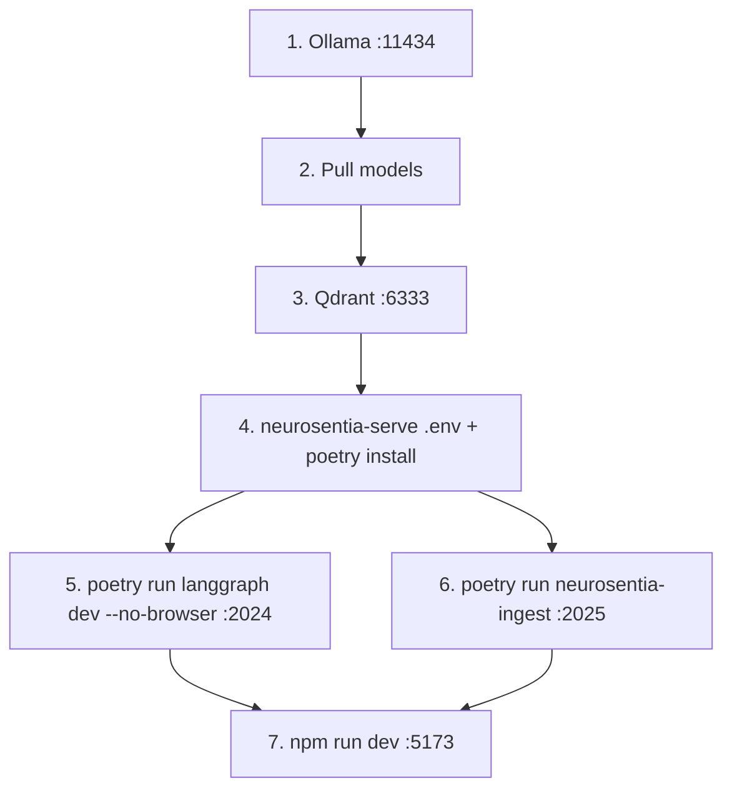

# React + TypeScript + Vite

A space where algorithms think, stories breathe, and art inspires.

Neurosentia is a studio site and live AI demo: a marketing home, educational writing, and **Turing’s Dream** — a CRT-styled conversational agent with RAG, web search, voice, and document ingest. We build fast websites and embed AI (chatbots, agents, RAG) for teams who want builders and thinkers, not another “transform your business” pitch.

This repo is the **frontend SPA**. The Python backend lives in the sibling repo [`neurosentia-serve`](https://github.com/shivanshuy/neurosentia-serve).

| Audience | What they use |
| --- | --- |
| Prospective clients | Home, services, proof → Turing’s Dream |
| Demo operators | Chat with RAG, search, voice, docs |
| Engineers / learners | *The Other Mind* essays + *Ohm’s Attic* |
| Fine-tune experimenters | Dataset find / build UI (train is a stub) |

---

## Architecture

Two independent git repos. No monorepo, no Docker, no auth.



**Dev vs preview:** the Vite proxy exists only for `npm run dev`. `npm run preview` serves static `dist/` with **no** proxy — point `public/config.json` at real serve URLs, or put nginx/Caddy in front.



### Ports

| Service | Port | URL |
| --- | --- | --- |
| Vite dev | **5173** | http://localhost:5173/#/ |
| Vite preview | **4173** | static only — no API proxy |
| LangGraph | **2024** | http://127.0.0.1:2024 |
| Ingest API | **2025** | http://127.0.0.1:2025/ingest/... |
| Ollama | **11434** | http://localhost:11434 |
| Qdrant | **6333** | http://localhost:6333 |

Dev browser paths (proxied):

- `/api/langgraph/*` → `http://127.0.0.1:2024/*`
- `/api/ingest/*` → `http://127.0.0.1:2025/ingest/*`

---

## Design

| Principle | How it shows up |
| --- | --- |
| Studio + product in one site | Marketing home, essays, and a working agent |
| Runtime config, no rebuild | `public/config.json` loaded before first render |
| Hash routing | `HashRouter` — static hosts need no rewrite rules |
| CRT “transmitter” metaphor | Turing’s Dream tabs: CHAT / DOCUMENTS / RECORDINGS |
| Content as data | `*Content.ts` objects + thin page wrappers via `PageItem` |
| Context, not a global store | Theme / font / settings providers; chat state in the page |
| Client-side persistence | Conversations, pins, persona, location in `localStorage` |
| Same-origin APIs in dev | Vite rewrites `/api/*` so the browser never hits CORS |
| Graphs as product features | LangGraph assistant IDs: `chatterbug`, `summarize`, `ingest` |
| SSE, not WebSockets | Token stream is `text/event-stream`; proxy disables buffering |
| No auth | Open demo. Serve CORS defaults to `*` |

### Boot

If `public/config.json` is missing, the app does **not** render — you get `CONFIG LOAD FAILED`.



FOUC prevention: `public/color-themes-init.js` and `public/font-presets-init.js` apply CSS variables before React mounts.

---

## Implementation

### Stack

| Layer | Choice |
| --- | --- |
| UI | React 19, TypeScript 5.8, Vite 7 |
| Components | MUI 7 + Emotion |
| Routing | `react-router` v7 `HashRouter` |
| HTTP | axios (REST) + native `fetch` (SSE) |
| PDF attach | `pdfjs-dist` 6 — requires **Node ≥ 22.13** |
| Diagrams in essays | `mermaid` |
| Backend | LangGraph Agent Server + FastAPI ingest (Poetry, Python 3.11–3.13) |
| LLM / embeddings / vision | Ollama — three models, see [Ollama models by use case](#ollama-models-by-use-case) |
| Vectors | Qdrant collection `neurosentia_docs` |
| Search tool | DuckDuckGo (`ddgs`) — not an LLM |
| OCR | Tesseract (optional, image ingest) — not an LLM |

There is no Redux/Zustand, no `@langchain/langgraph-sdk` (the client is hand-rolled in `src/ApiImpl.ts`), and no Vite `VITE_*` env vars for serve URLs.

### Ollama models by use case

The app never talks to Ollama. **neurosentia-serve** does, via three env vars in serve `.env`. Same chat model is reused for several jobs; embeddings and vision are separate tags.



| Role | Env var | `.env` value | Code fallback if unset | Used for |
| --- | --- | --- | --- | --- |
| **Chat / query LLM** | `OLLAMA_MODEL` | `mistral:latest` | `llama3.1:8b` | Turing’s Dream ReAct answers + tool calls; thread summarize; source briefing after ingest; mermaid from transcript; fine-tune dataset pair generation |
| **Embeddings** | `OLLAMA_EMBEDDING_MODEL` | `nomic-embed-text` | `nomic-embed-text` | **Index:** `embed_documents` when writing file / URL / image chunks to Qdrant. **Query:** `embed_query` when chatterbug retrieves for chat-with-docs |
| **Vision** | `OLLAMA_VISION_MODEL` | `moondream` | `moondream` | Image ingest modes `vision` and `both` (`POST /ingest/image`). `ocr` uses Tesseract only |

Temperatures (same chat model, different call sites):

| Call site | Temperature |
| --- | --- |
| Chatterbug ReAct (user query) | `OLLAMA_TEMPERATURE` (`.env` **0.5**; code default 0.7) |
| Thread summarize + ingest briefing | **0.2** |
| Mermaid generation | **0.1** |
| Fine-tune dataset build | **0.4** |
| Vision describe | `OLLAMA_VISION_TEMPERATURE` (**0.2**) |

Other knobs: `OLLAMA_BASE_URL` (default `http://localhost:11434`), `OLLAMA_KEEP_ALIVE=-1` (keep chat model loaded), `OLLAMA_NUM_CTX=4096`.

**Not Ollama:** DuckDuckGo live search, Tesseract OCR, browser Web Speech / `speechSynthesis`. Fine-tune **train** does not call any model yet.

Pull all three:

```powershell
ollama pull mistral:latest
ollama pull nomic-embed-text
ollama pull moondream
```

If tool-calling streams break on registry `mistral:latest`, use serve’s `scripts/setup-ollama-mistral.sh` to build `neurosentia-mistral-q4` and set `OLLAMA_MODEL` to that tag. Do **not** point `OLLAMA_MODEL` at the embedding or vision tags — RAG query embedding is always `OLLAMA_EMBEDDING_MODEL`.

### Repo map

```
neurosentia-app/
├── index.html                 # title Neurosentia; theme/font FOUC scripts
├── vite.config.ts             # /api/* proxies + SSE headers
├── public/
│   ├── config.json            # runtime serve URLs (required to boot)
│   ├── config.example.json    # prod-style absolute URLs
│   ├── color-themes-init.js
│   ├── font-presets-init.js
│   └── datasets/              # bundled fine-tune samples + templates
└── src/
    ├── main.tsx               # loadServeConfig → providers → App
    ├── App.tsx                # HashRouter routes
    ├── Home.tsx               # marketing landing
    ├── ChatBot.tsx            # Turing's Dream
    ├── ApiImpl.ts             # LangGraph + ingest orchestration
    ├── chatHistory.ts         # localStorage conversations
    ├── PageList.ts            # sidebar catalog
    ├── theme.ts / colorThemes.ts / fontPresets.ts
    ├── *Provider.tsx          # ColorTheme, FontPreset, Settings
    ├── config/serve.ts        # runtime config loader
    ├── chat/                  # chunking, voice, TTS, sources, pins
    ├── fineTune/              # dataset build client
    ├── components/            # chrome, viz, chat + fine-tune panels
    ├── pages/                 # essays + FineTunePage
    └── assets/
```

Companion backend (`neurosentia-serve`):

```
neurosentia-serve/
├── langgraph.json             # chatterbug, agent, summarize, diagram, ingest
├── restart.sh                 # kill + restart :2024 and :2025 (Unix)
├── neurosentia_serve/
│   ├── graphs/                # ReAct chat, summarize, URL ingest
│   ├── api/ingest_app.py      # FastAPI :2025
│   ├── api/fine_tune_routes.py
│   ├── finetune/dataset_builder.py
│   └── utils/                 # llm, embeddings, vector_store, tools
```

### Routes

URLs look like `http://localhost:5173/#/chatterbug`.

| Hash path | Screen |
| --- | --- |
| `/` | Home |
| `/chatterbug` | Turing’s Dream |
| `/the-other-mind`, `/ai-blog-items` | The Other Mind index |
| `/ai-agents`, `/react-agent-langgraph`, `/fine-tuning-techniques`, `/lora-fine-tuning`, `/llm-model-files`, `/gpu-llm-inference`, `/llm-quantization`, `/llm-datasets`, `/llama-cpp` | AI essays |
| `/fine-tune`, `/coding-blog` | Fine-tune UI |
| `/ohms-attic`, `/philosophy` | Ohm’s Attic index |
| `/harman-target`, `/koss-clip-ons`, `/sony-mdr-7506`, `/555-timer`, `/sennheiser-hd600`, `/mx-master` | Electronics posts |
| `/blog` | Titbits stub |

Sidebar also lists `/maths`, `/books`, `/contact` — those routes are not wired in `App.tsx` yet.

### Runtime config

`public/config.json` (copied to `dist/config.json` on build):

```json
{
  "langGraphUrl": "/api/langgraph",
  "ingestUrl": "/api/ingest",
  "ingestChunksPerRequest": 20
}
```

Production example (`public/config.example.json`):

```json
{
  "langGraphUrl": "https://serve.example.com",
  "ingestUrl": "https://serve.example.com/ingest",
  "ingestChunksPerRequest": 20
}
```

Edit `config.json` and reload — no rebuild.

### localStorage

| Key | Purpose |
| --- | --- |
| `ns-chat-history` | Conversations (max 50). UI `sessionId` **is** LangGraph `thread_id` |
| `ns-chat-location` | Operator city |
| `ns-chat-persona` | `brief` \| `architect` |
| `ns-memory-pins` | Up to 12 pin strings |
| `ns-color-theme` | Theme id (default `white-on-black`) |
| `ns-font-preset` | Font id |

Themes: `gold`, `yellow`, `orange`, `white-on-black`, `green-on-black`, `red-on-black`, `paperwhite`, `white-accent`.

### Graphs the UI actually calls

| Assistant ID | Used for |
| --- | --- |
| `chatterbug` | Chat stream |
| `summarize` | SUMMARIZE tab + auto rolling summary (≥12 messages, 5 min cooldown) |
| `ingest` | URL ingest only |
| `agent`, `diagram` | Registered on the server, unused by this UI |

File / image ingest goes to FastAPI `:2025`, not LangGraph. Fine-tune **train** is UI-only — it logs a waiting message and does not call a train endpoint.

---

## Sequence diagrams

### Chat turn (Turing’s Dream)



Stop: browser `AbortController` plus `POST /threads/{id}/runs/{runId}/cancel` `{ wait: false, action: "interrupt" }`.

Run `context` fields: `client_local_time`, `client_persona`, `client_location`, `memory_pins`, `rolling_summary`, `thread_id`, `session_source_ids`, `user_query`, `session_document`, `sources_only`.

### File ingest then chat-with-docs



Image ingest skips client chunking: `POST /ingest/image` (`ocr` \| `vision` \| `both`).  
URL ingest does **not** use `:2025` — it runs the `ingest` graph on `:2024` (`POST /threads/{id}/runs/wait`).  
Delete: `DELETE /ingest/sources/{thread_id}/{source_id}`.

### Fine-tune dataset build



---

## Prerequisites

| Dependency | Why |
| --- | --- |
| **Node.js ≥ 22.13** | `pdfjs-dist` 6 |
| **npm** | this repo |
| **Python 3.11–3.13 + Poetry** | neurosentia-serve |
| **Ollama** on `:11434` | three models — see [Ollama models by use case](#ollama-models-by-use-case) |
| **Qdrant** on `:6333` | RAG |
| **Tesseract** on `PATH` (optional) | image OCR |
| Sibling checkout of **neurosentia-serve** | LangGraph + ingest |

---

## Start everything

Order matters: infra first, then serve, then the app.



### 1–3. Infra

Start Ollama (Windows service, or `ollama serve`) and Qdrant. Confirm:

```powershell
curl http://127.0.0.1:11434/api/tags
curl http://127.0.0.1:6333/readyz
```

### 4–6. Backend (separate terminals)

```powershell
cd D:\projects\ai-projects\neurosentia-serve
copy .env.example .env
poetry install

# terminal A
poetry run langgraph dev --no-browser

# terminal B
poetry run neurosentia-ingest
```

Unix VPS helper (backgrounds both, writes `logs/*.pid` + `logs/*.log`):

```bash
cd /path/to/neurosentia-serve
./restart.sh
```

`restart.sh` is bash/`fuser`/`lsof`/`nohup` — not for this Windows checkout. On Windows, keep the two Poetry processes in terminals.

### 7. Frontend

```powershell
cd D:\projects\ai-projects\neurosentia-app
npm install
npm run dev
```

Open http://localhost:5173/#/ then http://localhost:5173/#/chatterbug.

### Health checks

| Check | Expect |
| --- | --- |
| http://127.0.0.1:2024/ok | LangGraph up |
| http://127.0.0.1:2024/docs | Agent Server OpenAPI |
| http://127.0.0.1:2025/health | Ingest up |
| http://127.0.0.1:2025/ingest/config | chunk limits + vision model |
| [LangSmith Studio](https://smith.langchain.com/studio/?baseUrl=http://127.0.0.1:2024) | graph inspector |

### npm scripts

| Script | Port | Notes |
| --- | --- | --- |
| `npm run dev` | 5173 | HMR + `/api/*` proxies |
| `npm run build` | — | `tsc -b` then `dist/` |
| `npm run preview` | 4173 | static `dist/`, **no proxy** |
| `npm run lint` | — | ESLint 9 |

---

## Kill everything

Ctrl+C in each terminal is enough. To force-kill by port on **Windows PowerShell**:

```powershell
# App + preview
Get-NetTCPConnection -LocalPort 5173,4173 -ErrorAction SilentlyContinue |
  ForEach-Object { Stop-Process -Id $_.OwningProcess -Force }

# Serve
Get-NetTCPConnection -LocalPort 2024,2025 -ErrorAction SilentlyContinue |
  ForEach-Object { Stop-Process -Id $_.OwningProcess -Force }
```

Or:

```powershell
netstat -ano | findstr ":5173 :2024 :2025"
taskkill /PID <pid> /F
```

**Unix / `restart.sh` style:**

```bash
pkill -f "langgraph dev" || true
pkill -f "neurosentia-ingest" || true
fuser -k 2024/tcp 2025/tcp 5173/tcp 2>/dev/null || true
# fallback:
# lsof -ti:2024,2025,5173 | xargs -r kill -9
```

Ollama and Qdrant are **not** owned by these repos — stop their own services/containers if you want a full teardown:

```powershell
# Qdrant: stop the container / binary you started
# Ollama Windows: quit the tray app or stop the service
```

---

## Production sketch

There is no Dockerfile or process manager in either repo. Intended shape:

1. `npm run build` → deploy static `dist/` (GitHub Pages, S3, nginx). HashRouter needs no SPA fallback.
2. Ship `dist/config.json` with absolute serve URLs **or** reverse-proxy `/api/langgraph` → `:2024` and `/api/ingest` → `:2025/ingest`.
3. Run `langgraph` Agent Server + `neurosentia-ingest` + Ollama + Qdrant on the server/VPC.
4. Keep `INGEST_API_RELOAD=false` while dataset-build jobs run (reload drops in-memory workers).

---

## Current gaps

- Fine-tune **Train** tab is a teaser — no train API.
- No login, API keys, or multi-tenant isolation. `thread_id` scopes Qdrant points.
- Sidebar Maths / Bookshelf / Know Me are dead links; `/blog` is a stub.
- Some chat viz components (`EntityHeatMap`, `TimelineRail`, `ThreadContextMap`, `AudioChannel`) are not mounted in `ChatBot` yet; memory pins still go out in run context.
- Unused npm deps: `@mui/lab`, `@mui/x-charts`, `react-pro-sidebar`.

Contact: `ueurosent@gmail.com` (site footer).
